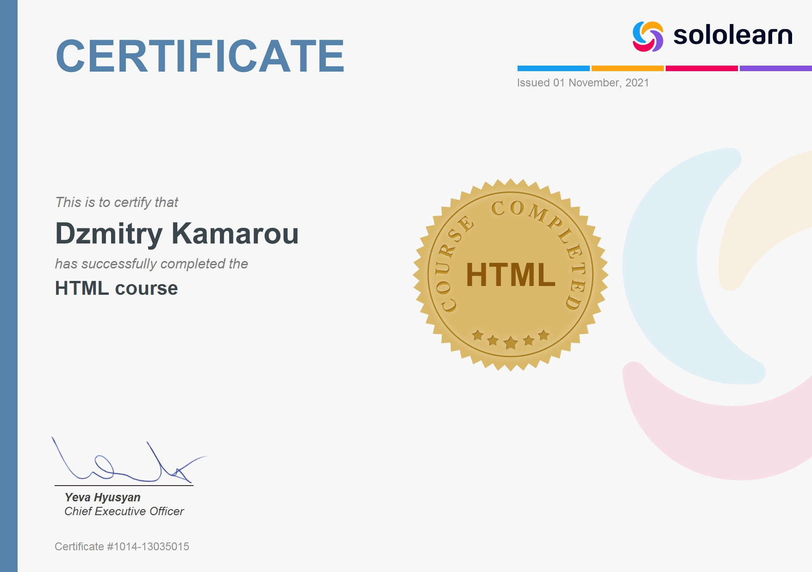
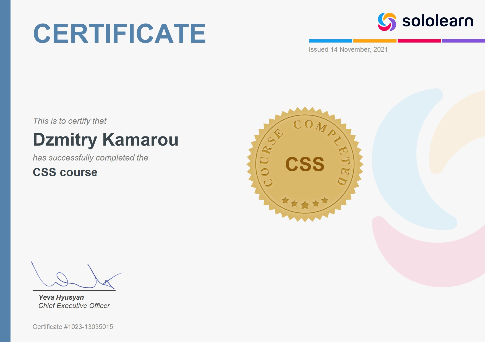
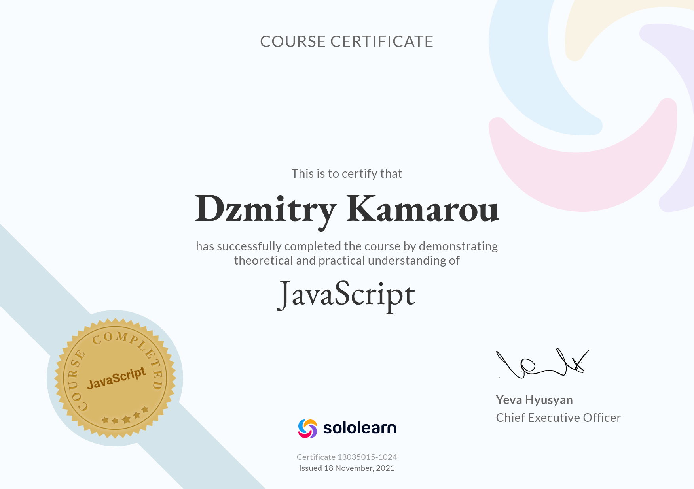
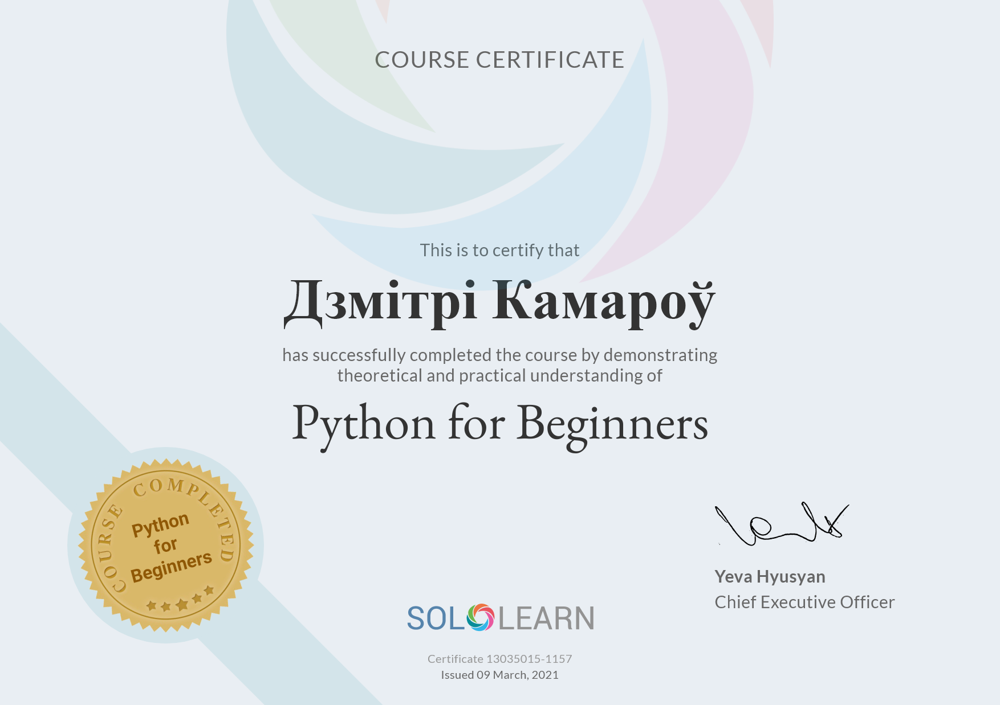
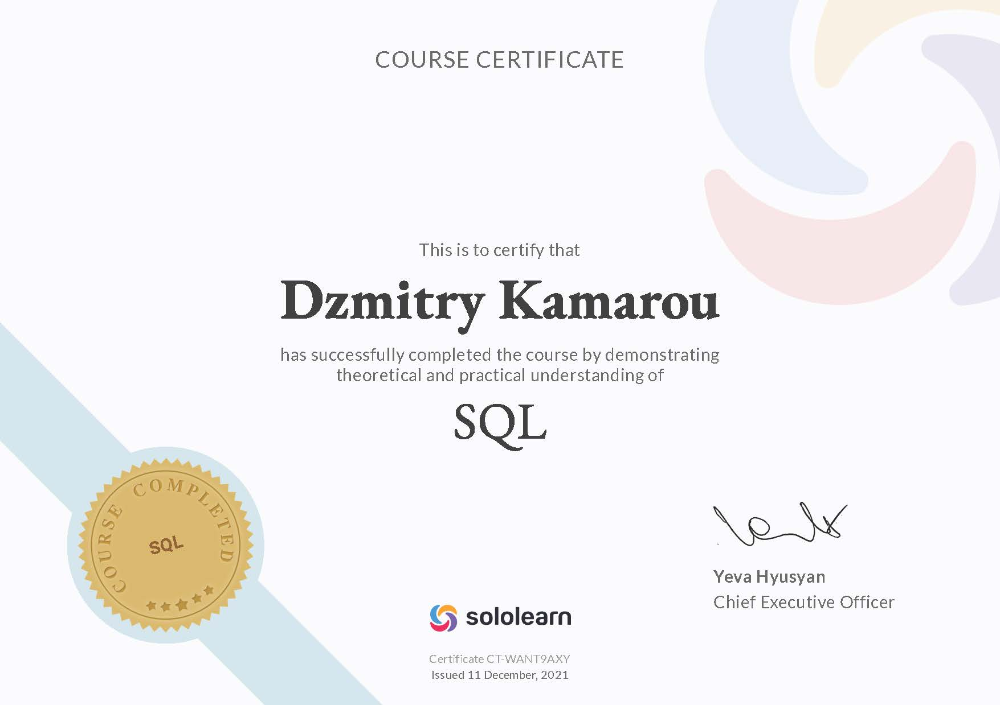
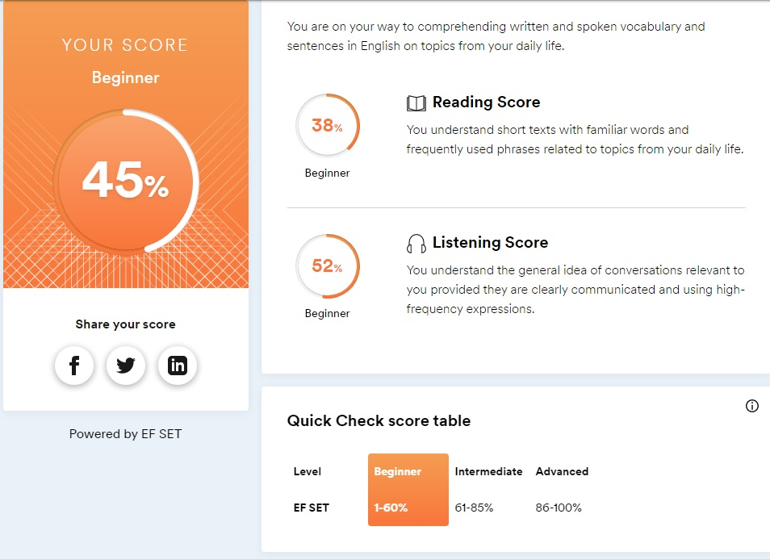

# **CV для RS-school.**
***
> ## Комаров Дмитрий

###  `dr.komarov@mail.ru, Discord: Dzi-man#6809, `
___

Хочу стать FrontEnd  разработчиком.

---
Способен учиться и переобучаться.
На SoloLear изучал  и получил сертификаты HTML,
CSS, JS, Pyton-beginer, SQL. начинал работы с Git

****
Опыт работы. создавал  сайты в яндекс практикум, для себя  
создавал в  Vstudio, От JetBrain работал с  WebStorm,
немного работал с GitHub

----
Пример решения задачи  при регистрации **https://www.codewars.com/** :
function multiply (a, b) {
return a * b
}
----

Английский язык  по тестам beginer,
хотя заканчивал гимназию с английским уклоном.

